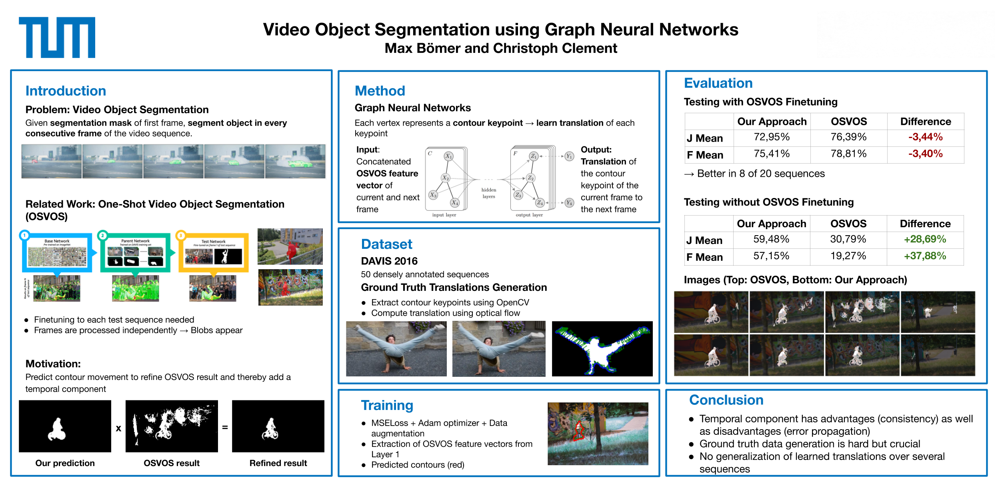

# One Shot Video Object Segmentation with GCN-based contour propagation


## Repository Structure
- **download_DAVIS_2016.sh**: Downloads DAVIS 2016 dataset and saves it to **DAVIS_2016**
- **create_contours_and_translations.ipynb**: Contour points and translation for each contour point are computed using Optical Flow and saved as Numpy arrays.
- **gnn_training.ipynb**: Creates a custom PyTorch Geometric Dataset for the DAVIS 2016 dataset and trains graph neural networks.
- **DAVIS_2016**: Folder in which DAVIS 2016 dataset is stored
- **Images**: Folder in which images used in notebooks are stored
- **OSVOS-PyTorch**: Original OSVOS-PyTorch implementation
- **pg_datasets**: Folder to store PyTorch Geometric (PG) DAVIS 2016 dataset
- **pg_models**: Folder to store training runs for tensorboard
- **pg_networks**: Folder to store different types of PG networks
- **src**: Folder to store scripts for data creation, the PG dataset class, visualization, and training

## Dependencies
- See spec-file_linux.txt for condaenv for ubuntu 16.04
- See spec-file_win64.txt for condaenv for windows 10


## ToDos
- [x] Check which sequences to use [Christoph]
```python
SKIP_SEQUENCES = ['bmx-trees', 'bus', 'cows', 'dog-agility', 'horsejump-high', 
                  'horsejump-low', 'kite-walk', 'lucia', 'libby', 'motorbike',
                  'paragliding', 'rhino', 'scooter-gray', 'swing']
TRAIN_SEQUENCES = ['bear', 'bmx-bumps', 'boat', 'breakdance-flare', 'bus', 
                   'car-turn', 'dance-jump', 'dog-agility', 'drift-turn', 
                   'elephant', 'flamingo', 'hike', 'hockey', 'horsejump-low', 
                   'kite-walk', 'lucia', 'mallard-fly', 'mallard-water', 
                   'motocross-bumps', 'motorbike', 'paragliding', 'rhino', 
                   'rollerblade', 'scooter-gray', 'soccerball', 'stroller',
                   'surf', 'swing', 'tennis', 'train']

VAL_SEQUENCES = ['blackswan', 'bmx-trees', 'breakdance', 'camel', 'car-roundabout',
                 'car-shadow', 'cows', 'dance-twirl', 'dog', 'drift-chicane', 
                 'drift-straight', 'goat', 'horsejump-high', 'kite-surf', 'libby', 
                 'motocross-jump', 'paragliding-launch', 'parkour', 'scooter-black', 
                 'soapbox']
```
